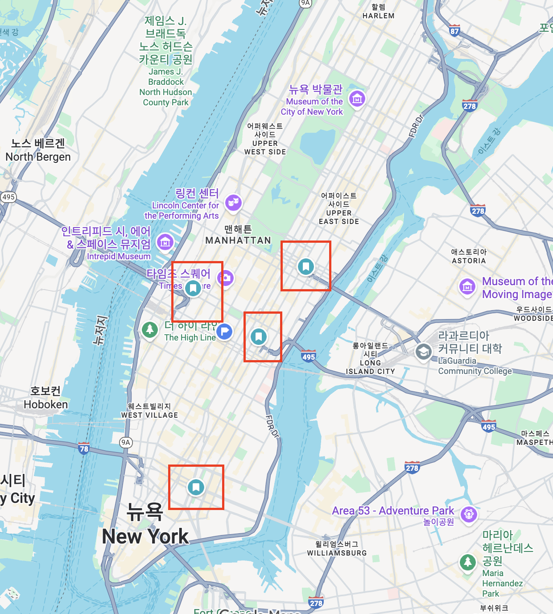

```{r}
library(tidyverse)
```

## Introduction

New York City is one of the most congested and densely populated cities in the world. Millions of residents, commuters, and visitors move through its streets every day by foot, car, and public transportation. The [INRIX 2024 Global Traffic Scorecard](https://inrix.com/press-releases/2024-global-traffic-scorecard-us/) ranks New York City among the most congested cities in both the United States and the world, reflecting extreme levels of delay and time spent in traffic for drivers. In such an environment, motor vehicle collisions are not only common but also an important public safety concern. Thus, this analysis aims to identify **what patterns and trends exist in NYC's motor vehicle collisions.**

New York City publishes detailed open data on crashes through the NYC Open Data portal, including the [Motor Vehicle Collisions - Crashes](https://catalog.data.gov/dataset/motor-vehicle-collisions-crashes) and [Vehicle information of NYC Motor Vehicle Collisions](https://data.cityofnewyork.us/Public-Safety/Motor-Vehicle-Collisions-Vehicles/bm4k-52h4) datasets maintained by the New York Police Department (NYPD). Using these datasets, we will try to identify spatial and vehicle-related patterns in crash data. First, we will look at the spatial pattern of collisions within Manhattan using the Motor Vehicle Collisions - Crashes dataset and its latitude/longitude feature. Second, we will examine which kinds of vehicles (types and brands) are most frequently involved in crashes citywide. 

## Spatial Pattern Analysis

### Questions

Some areas in cities may be more prone to vehicle crashes, and this analysis will focus on spatial patterns of Manhattan vehicle collisions.

More specifically, we will try to answer:

-  In which neighborhoods or areas do vehicle collisions most often occur?

### Crash data

This analysis used the [Motor Vehicle Collisions - Crashes](https://catalog.data.gov/dataset/motor-vehicle-collisions-crashes) dataset, provided through NYC Open Data and maintained by the NYPD. The dataset includes a record for each reported collision, with information such as date and time, geographic coordinates (latitude and longitude), borough, numbers of people injured or killed, and contributing factors. The population of interest are all motor vehicle collisions occurring in New York City, but the sample actually observed will be NYPD-reported collisions from approximately 2012 through 2025 that appear in the open data system. 

For a glimpse of the dataset, see below:

```{r}
crashes <- read.csv("MotorVehicleCollisions_Crashes.csv")
crashes |> glimpse()
```

The key features included in this analysis are: LATITUDE, LONGITUDE, BOROUGH. Other features such as number of persons injured and vehicle type codes are not significant to this analysis.

### Data Preparation

The goal is to estimate where crashes cluster within Manhattan. 

First, I selected relevant columns and filtered it to collisions where the borough is Manhattan. Then using filter again, I limited the latitude and longitude to a bounding box around Manhattan. This step removed incorrect or out-of-bounds data points. 

```{r}
filtered_crashes <- crashes |>
    select(LATITUDE, LONGITUDE, BOROUGH) |>
    filter(BOROUGH == "MANHATTAN") |>
    filter(LATITUDE < 42 & LATITUDE > 40.68) |>
    filter(LONGITUDE > -74.03 & LONGITUDE < -73.91) 
```

### Visualization with density map

To visualize spatial patterns, I placed each crash on a density map with x and y being longitude and latitude.

```{r}
filtered_crashes |>
  ggplot(aes(x = LONGITUDE, y = LATITUDE)) +
  stat_density_2d(aes(fill = after_stat(level)), geom = "polygon") +
  coord_quickmap() +
  labs(
    x = "Longitude", y = "Latitude",
    title = "",
    subtitle = "NYC motor vehicle collisions since 2012",
    caption = "Data available at: https://catalog.data.gov/dataset/motor-vehicle-collisions-crashes"
  ) +
  theme_minimal()
```

From this map, we can see that Midtown(especially areas around times square and the east side) and east Lower Manhattan are hotspots for crashes. 

### Spatial analysis results

Midtown and east lower manhattan are areas where vehicle collisions happened the most. This can be due to a variety of reasons. Midtown may showcase a high volume of collisions because it has extreme number of pedestrians and tourist attractions which may lead to higher conflict points. Lower manhattan areas' streets were built in the 1600~1800s, so the narrow and irregular street geometry might play a part in their high collision patterns. There is a lot of plausible theories, but we can't pinpoint a certain cause currently.

However, there is a pattern that may be interesting:


This is a screenshot of a google map of manhattan. I added red boxes to where the collisions were most clustered(blue colors were the brightest) in the density map. When we look at the red boxes, we could see those are all areas that connect to a bridge/tunnel that goes outside of manhattan. Two hotspots in east midtown connect with the Ed Koch Queensboro Bridge and Queens-Midtown Tunnel respectively. The hotspot near times square connect to the Lincoln Tunnel. The lower manhattan hotspot connects with the Williamsburg Bridge. These bridges and tunnels may be a key commuting path for people living outside of manhattan, thus exhibiting a high vehicular flow. Points that connect to the entrance of such tunnels/bridges are likely to be a major bottleneck point, with sudden speed changes/lane merging activities also being likely to happen. Although we can't be 100% certain, this could be a plausible cause of the cluster patterns around these areas.


## Analysis of Vehicle types

### Questions
There are many different vehicle types and brands in city traffic, and distinct vehicle types and brands might show different patterns in collisions. In this anlaysis, we will focus on which kinds of vehicles appear most often in the crash records.

The specific question is:

-  Which vehicle types (e.g., Sedan, SUV, Taxi, Bus) are most frequently involved in NYC collisions?
-  Which vehicle brands (e.g., Toyota, Honda, Ford) are most frequently involved in NYC collisions?

### Vehicle Data

This analysis used the [Motor Vehicle Collisions - Vehicles ](https://data.cityofnewyork.us/Public-Safety/Motor-Vehicle-Collisions-Vehicles/bm4k-52h4) dataset, also from NYC Open Data and maintained by the NYPD. Each row typically corresponds to a single vehicle involved in a reported collision. The population of interest is all vehicles operating in NYC that could be involved in collisions, and the sample is vehicles recorded in NYPD crash reports from April 2016.

For a sample of our data, see below:

```{r}
vehicles <- read.csv("MotorVehicleCollisions_Vehicles.csv")
vehicles |> glimpse()
```

The key features included in this analysis are VEHICLE_TYPE and VEHICLE_MAKE. Other vehicle-level details are less central for this analysis.

### Data Preparation

I first had to clean up the messy names for vehicle types and brands and create cleaner categories for both. To do this, I first needed to exclude rows with missing values in VEHICLE_TYPE and VEHICLE_MAKE. Then, I excluded generic “PASSENGER VEHICLE” entries, which are too vague. 

```{r}
#| eval: true
#| echo: true

filtered_vehicles <- vehicles |> 
  select(VEHICLE_TYPE, VEHICLE_MAKE) |>
  filter(!is.na(VEHICLE_TYPE)) |>
  filter(!is.na(VEHICLE_MAKE)) |>
  filter(VEHICLE_MAKE != "") |>
  filter(VEHICLE_TYPE != "PASSENGER VEHICLE") 
```

Then, I used conditional transformation to group similar vehicle types into broader categories (SUV, Truck, etc.):

```{r}
#| eval: true
#| echo: true

filtered_vehicles <- filtered_vehicles |> 
  mutate(vehicle_type = case_when(
    VEHICLE_TYPE %in% c("Station Wagon/Sport Utility Vehicle", "SPORT UTILITY / STATION WAGON") ~ "SUV",
    VEHICLE_TYPE %in% c("Pick-up Truck", "Box Truck", "Flat Bed", "LARGE COM VEH(6 OR MORE TIRES)") ~ "Truck",
    VEHICLE_TYPE %in% c("Sedan", "4 dr sedan", "2 dr sedan", "Convertible") ~ "Sedan",
    VEHICLE_TYPE %in% c("TAXI", "Taxi") ~ "Taxi",
    VEHICLE_TYPE %in% c("Bus", "School Bus") ~ "Bus",
    VEHICLE_TYPE %in% c("Motorcycle", "MOTORCYCLE") ~ "Motorcycle",
    VEHICLE_TYPE %in% c("VAN") ~ "Van",
    VEHICLE_TYPE %in% c("UNKNOWN", "OTHER") ~ "Other",
    TRUE ~ "Other" ))
```

Then, I used conditional transformation again to rename brand codes into human-readable brand names (Toyota, Honda, Ford, etc.):
```{r}
#| eval: true
#| echo: true

filtered_vehicles <- filtered_vehicles |> 
  mutate(car_brand = case_when(
    VEHICLE_MAKE %in% c("TOYT -CAR/SUV", "TOYT-TRUCK/BUS", "TOYT -TRUCK/BUS") ~ "Toyota",
    VEHICLE_MAKE %in% c("FORD -CAR/SUV", "FORD-TRUCK/BUS", "FORD -TRUCK/BUS") ~ "Ford",
    VEHICLE_MAKE %in% c("HOND -CAR/SUV", "HOND -MCL")                         ~ "Honda",
    VEHICLE_MAKE == "BMW -CAR/SUV"                                            ~ "BMW",
    VEHICLE_MAKE == "VOLK -CAR/SUV"                                           ~ "Volkswagen",
    VEHICLE_MAKE == "NISS -CAR/SUV"                                           ~ "Nissan",
    VEHICLE_MAKE == "KIA -CAR/SUV"                                            ~ "Kia",
    VEHICLE_MAKE == "LEXS -CAR/SUV"                                           ~ "Lexus",
    VEHICLE_MAKE == "CHEV -CAR/SUV"                                           ~ "Chevrolet",
    VEHICLE_MAKE == "JEEP -CAR/SUV"                                           ~ "Jeep",
    VEHICLE_MAKE == "MERZ -CAR/SUV"                                           ~ "Mercedes-Benz",
    VEHICLE_MAKE == "AUDI -CAR/SUV"                                           ~ "Audi",
    VEHICLE_MAKE == "GMC -CAR/SUV"                                            ~ "GMC",
    VEHICLE_MAKE == "CHRY -CAR/SUV"                                           ~ "Chrysler",
    VEHICLE_MAKE == "PORS -CAR/SUV"                                           ~ "Porsche",
    VEHICLE_MAKE == "DODG -CAR/SUV"                                           ~ "Dodge",
    VEHICLE_MAKE == "LINC -CAR/SUV"                                           ~ "Lincoln",
    VEHICLE_MAKE == "INFI -CAR/SUV"                                           ~ "Infiniti",
    TRUE ~ "Other"
  )) |>
  select(vehicle_type, car_brand)
```
The “Other” category combines many smaller brands, which means we lose some detail, but we needed this to keep the visualization easier to understand. 

This is a glimpse of the refined dataset:
```{r}
#| eval: true
#| echo: true

filtered_vehicles |> glimpse()
```


### Visualizations with barplot

First, we will look at how often each vehicle type is involved in collisions.

```{r}
#| fig.alt: Barplot of NYC Motor Vehicle Collision vehicle data, showing that Sedans and SUVs account for the majority of collisions while public transports like buses and taxis take a relatively small portion

filtered_vehicles |>
  ggplot(aes(x = vehicle_type)) +
  geom_bar() +
  labs(title = "Sedan and SUV account for majority of traffic accidents",
       subtitle = "NYC's Motor Vehicle Collision vehicle data since April 2016",
       caption = "Data available at: https://data.cityofnewyork.us/Public-Safety/Motor-Vehicle-Collisions-Vehicles/bm4k-52h4",
       x = "Vehicle Type", y = "Count")
```
From this figure we can see patterns like Sedans and SUVs dominating the counts of collisions, and taxis involved more frequently in collisions than buses. 

Next we will look at how often each vehicle brand is involved in collisions.

```{r}
#| fig.alt: Barplot of NYC Motor Vehicle Collision vehicle data, showing that Toyotas account for the highest number of collisions in NYC, followed by Honda, Nissan, and Ford

filtered_vehicles |>
  ggplot(aes(y = car_brand)) +
  geom_bar() +
  labs(title = "Toyotas account for the highest number of collisions in NYC",
       subtitle = "NYC's Motor Vehicle Collision vehicle data since April 2016",
       caption = "Data available at: https://data.cityofnewyork.us/Public-Safety/Motor-Vehicle-Collisions-Vehicles/bm4k-52h4",
       x = "Count", y = "Vehicle Brand")
```

In total, Toyota has the highest count among brands, followed by other very common brands such as Honda, Nissan, and Ford.

### Vehicle Type Results

From the visualizations, Sedans and SUVs account for the majority of collisions, and taxis are involved more frequently in accidents than buses. Also, Toyota has the highest count among brands, followed by other very common brands such as Honda, Nissan, and Ford. However, it is important to note that this analysis looks only at counts of involvement, not crash risk. For example, Toyota vehicles might appear more often simply because there are more Toyotas on the road, not necessarily because they are less safe. The distribution aligns with what we might expect from market share, since brands that are more common in the general car population will show up more often in the collision dataset. These figures describe how much they get involved, and we cannot say that Toyota or sedans are “more dangerous” from this.


## General Conclusions and Limiatations

Bringing the two parts of the analysis together, we can summarize our findings as follows.

Midtown and lower east manhattan are areas where crashes are most likely to happen, and possible reasons may include high pedestrian and vehicle traffic, outdated roads, and connections to bridges and tunnels. For car types, Sedans and SUVs make up the majority of vehicle collisions, and Toyota, Honda, Nissan, and Ford appear most frequently among vehicle collisions. However, these results are produced simply because these car types and brands are just the most popular among the general vehicle population. 

Also, I would like to evaluate about some possible biases that might be inherent in this analysis.  

For the spatial analysis, the dataset likely under-represents minor incidents, such as collisions that are not reported to the police or do not result in injuries. It is best understood as a broad but imperfect record of more serious incidents that reach NYPD. Also, I visually calculated the approximate latitude/longtitude of crash hotspots fromthe density map, and it might not be 100% accurate. A more precise calculation of latitude and longtitude may be needed. 

For the vehicle analysis, “PASSENGER VEHICLE” and entries with missing or blank VEHICLE_MAKE were excluded, and this may have led to some underestimatation of the involvement of more generic passenger vehicles and any brands labeled this way. Also, since we didn't use information on how many of each brand or type are on the road, true collision rates cannot be computed, and common brands/types may look more involved simply because they are more common in the population.

